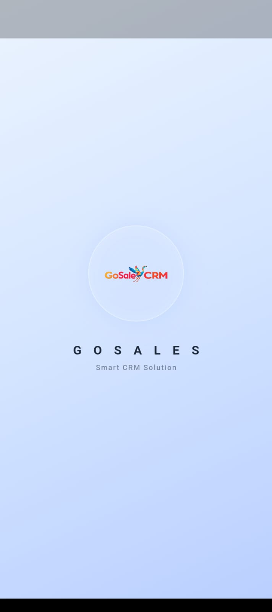
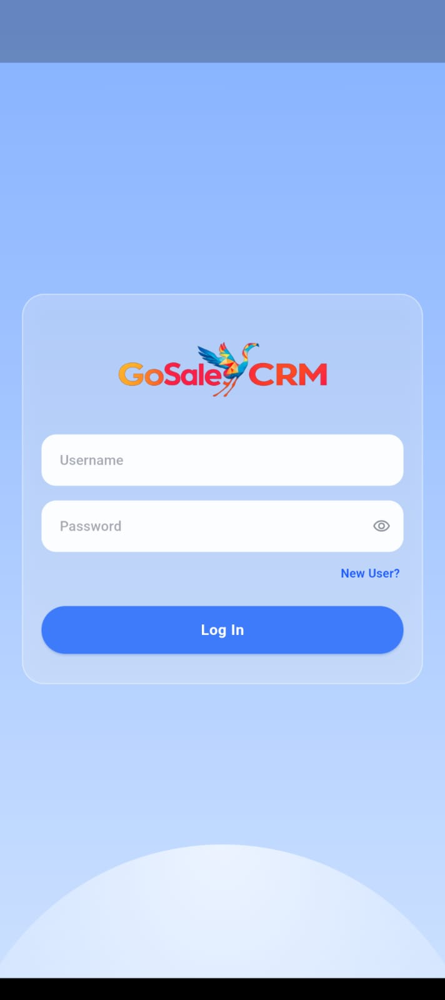
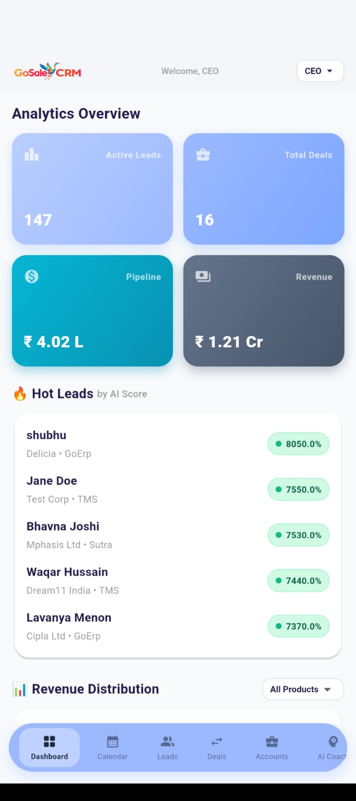
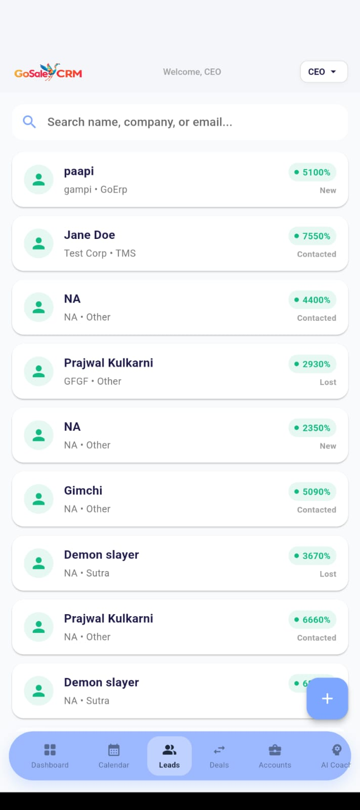
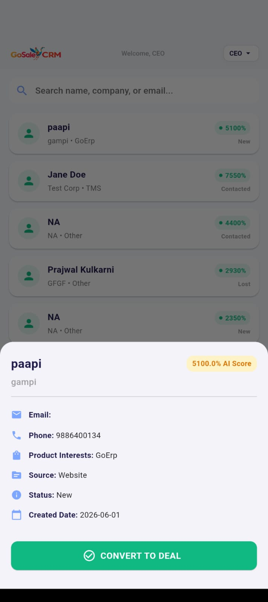
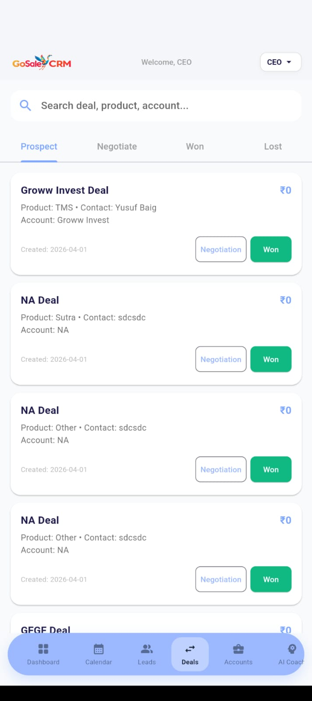
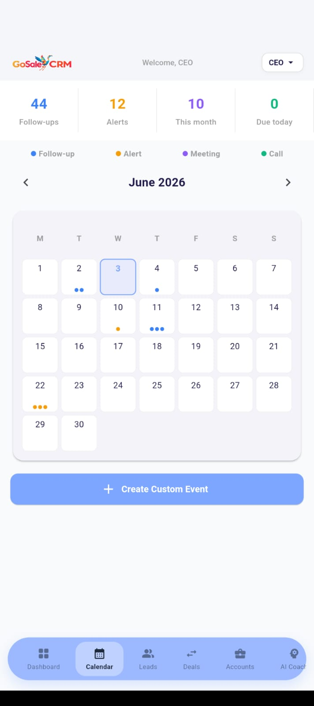
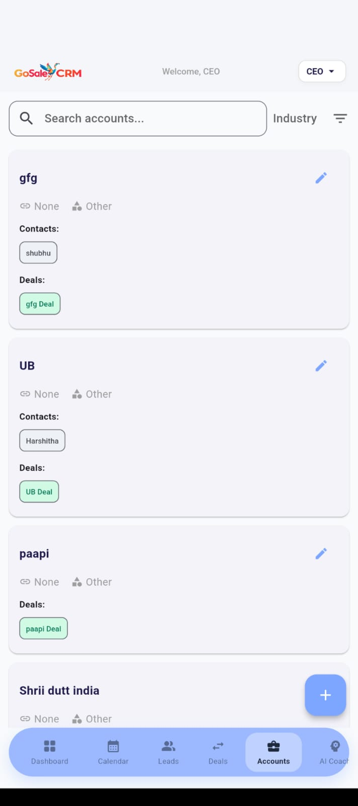
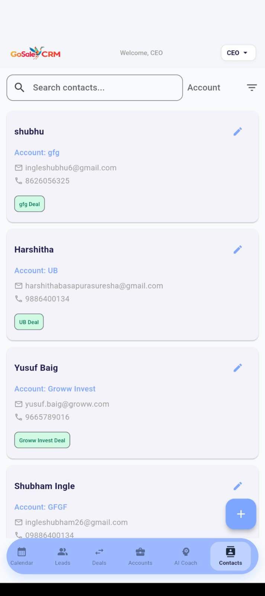
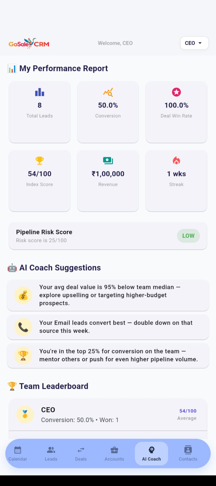

<!--  -->

# 📱 GoSale CRM — Mobile App

**The full GoSale CRM experience, built for mobile.**  
Every feature. Every screen. Fully responsive — no separate codebase.

---

## Overview

No React Native. No Flutter. No install.

GoSale CRM is built mobile-first — every screen, every AI feature, every workflow works seamlessly on any mobile browser. Sales reps can manage leads, close deals, and get AI coaching reports entirely from their phones.

---

## Screenshots

### 🔐 Login
> Clean glassmorphism login with password visibility toggle and splash screen on launch.

&nbsp;&nbsp;

---

### 📊 Dashboard
> Live analytics overview — active leads, total deals, pipeline value, revenue, and AI-ranked hot leads sorted by score.

---

### 🎯 Leads
> Full leads list with AI scores, status, company, and product. Tap any lead to view details and convert to a deal instantly.

&nbsp;&nbsp;

---

### 🤝 Deals
> Full deal pipeline — Prospect, Negotiate, Won, Lost. One tap to mark a deal won or move it to negotiation.

---

### 🗓️ Calendar
> Activity calendar with colour-coded follow-ups, alerts, meetings, and calls. Summary stats at the top, custom event creation below.

---

### 🏢 Accounts
> Company account cards with linked contacts, deals, and industry tags — all searchable and filterable.

---

### 👤 Contacts
> Full contact directory with email, phone, linked account, and associated deals — all in one clean card view.

---

### 🤖 AI Sales Coach
> Personal performance report — total leads, conversion rate, deal win rate, revenue, index score, pipeline risk, AI coaching suggestions, and team leaderboard. All on your phone.

---

## Mobile Feature Coverage

| Module | Status |
|---|---|
| Splash Screen | ✅ |
| Login & Authentication | ✅ |
| Dashboard & Analytics | ✅ |
| Leads — List, Detail, Convert to Deal | ✅ |
| Deals — Pipeline, Prospect / Negotiate / Won / Lost | ✅ |
| Activity Calendar | ✅ |
| Accounts Management | ✅ |
| Contacts Directory | ✅ |
| AI Sales Coach & Team Leaderboard | ✅ |
| Bottom Navigation Bar | ✅ |

---

## How It Works

Open **[gosalescrm.pythonanywhere.com](https://gosalescrm.pythonanywhere.com)** on any mobile browser.  
No download. No install. Just log in and go.

---

## Tech

| | |
|---|---|
| **Backend** | Python, Django |
| **Frontend** | HTML, CSS, Bootstrap, JavaScript |
| **Responsive** | Mobile-first CSS, Bootstrap grid |
| **Deployment** | PythonAnywhere |

---

## Web Version

📌 [View Full Web CRM Documentation →](./README.md)

---

Built by **Prajwal Kulkarni** — Full Stack Developer, Bengaluru.

