<div align="center">

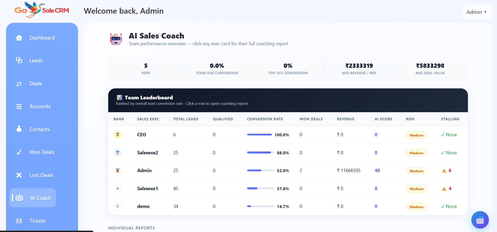

# GoSale AI Sales CRM

**A full-stack, AI-powered Sales CRM — built solo, deployed to production.**

[](https://python.org)
[](https://djangoproject.com)
[](https://developer.mozilla.org/en-US/docs/Web/JavaScript)
[](https://gosalescrm.pythonanywhere.com)

</div>

---

## What is GoSale?

GoSale is a production-grade AI-powered Sales CRM I built from scratch — everything from the database schema and Django backend to the frontend UI, AI integrations, and live deployment. It's actively used to manage real leads, deals, and sales workflows.

No boilerplate. No starter kit. Built line by line.

---

## Screenshots

### 📊 Dashboard
> Real-time overview of active leads, deal pipeline value, revenue, and AI-ranked hot leads.

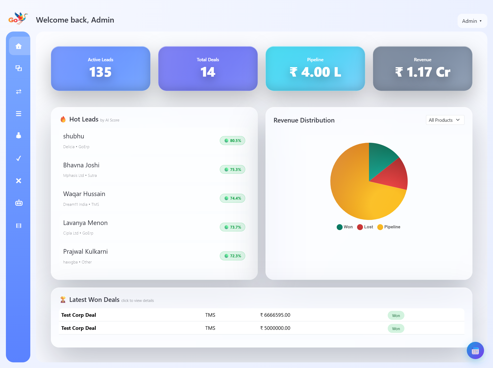

---

### 🎯 Leads
> 72+ leads with AI scoring, status tracking, follow-up management, and Excel import.

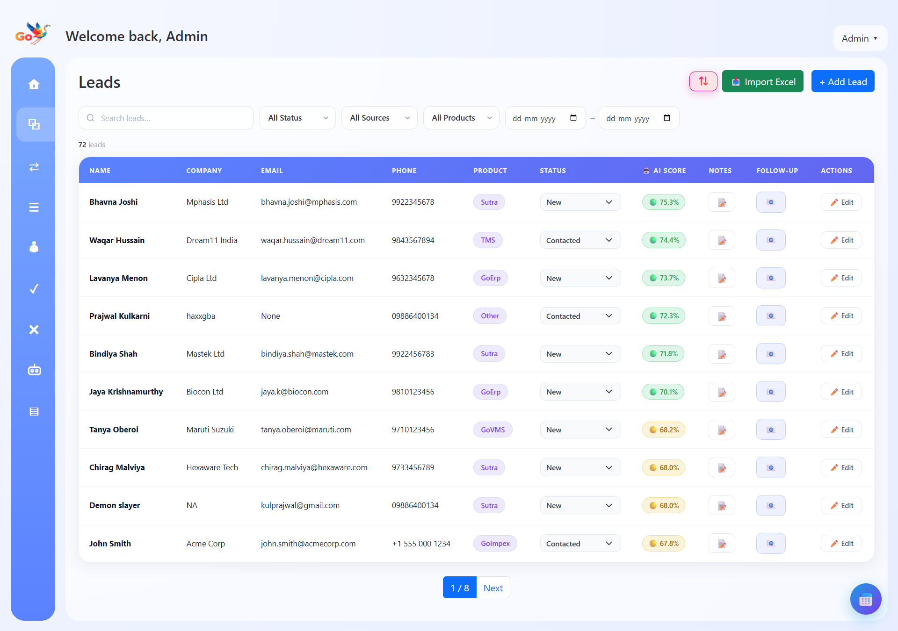

---

### 💬 Follow-up System
> Quick follow-up templates, note history, and one-click send — directly from the leads table.

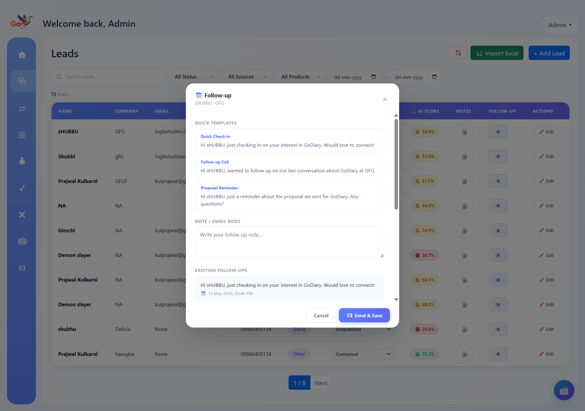

---

### 🤝 Deals
> Full deal pipeline — Prospect → Won → Lost — with product tagging and follow-up tracking.

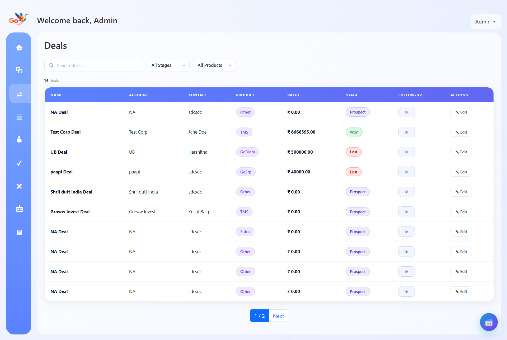

---

### 🏆 Won Deals
> Won deals with auto-generated invoices and service agreements — downloadable as PDF.

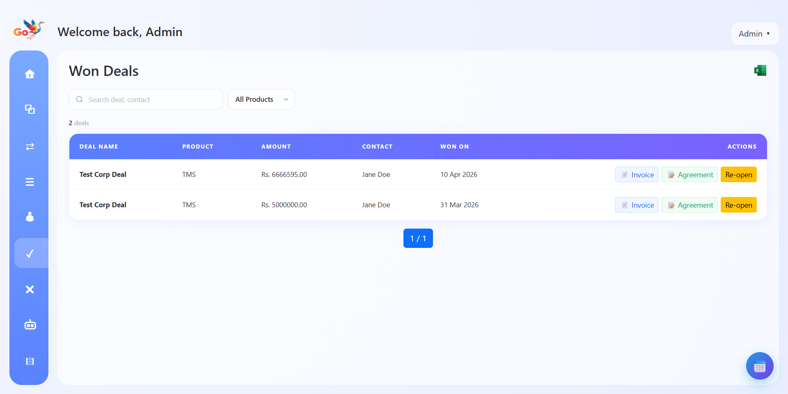

---

### 🤖 AI Sales Coach
> Per-rep coaching reports with conversion rates, revenue intelligence, deal summaries, and AI-generated recommendations. Includes a team leaderboard ranked by performance.

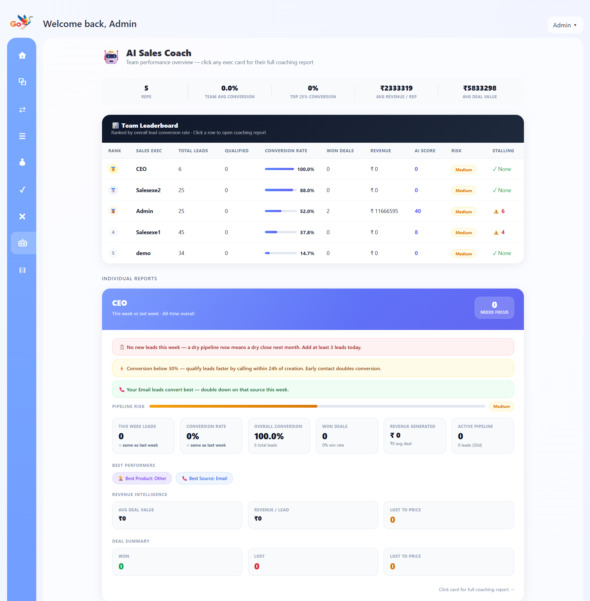

---

### 📧 Bulk Emailer
> Select leads or contacts, compose personalised emails with template variables, and send or queue — all from within the CRM.

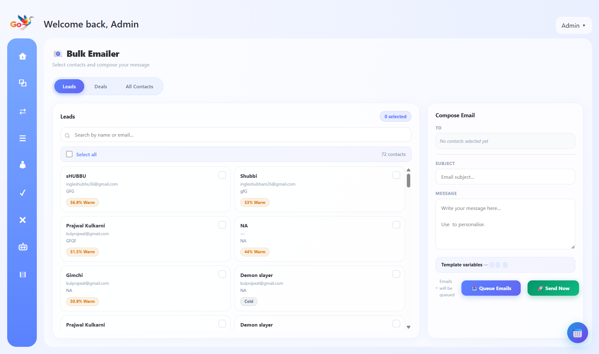

---

### 🗓️ Activity Calendar
> Follow-ups, alerts, meetings, and calls — visualised in a monthly calendar view.

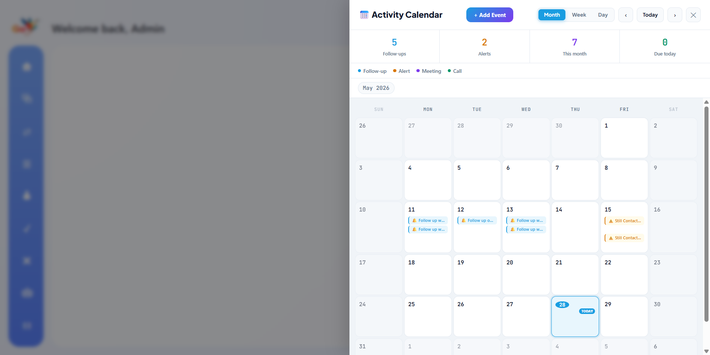

---

### 🏢 Accounts & Contacts
> Account management with linked contacts and deal associations across organisations.

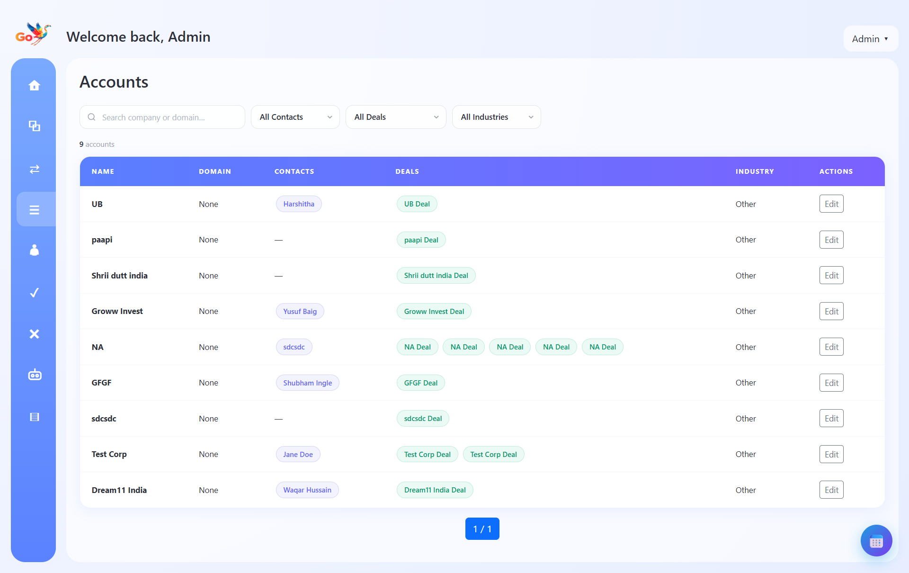
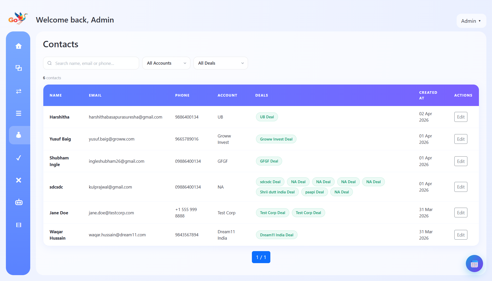

---

### 🔧 Tech Reviews (Lost Deal Tracker)
> Track product issues from lost deals — bugs, scalability, latency, permissions — with priority and status management.

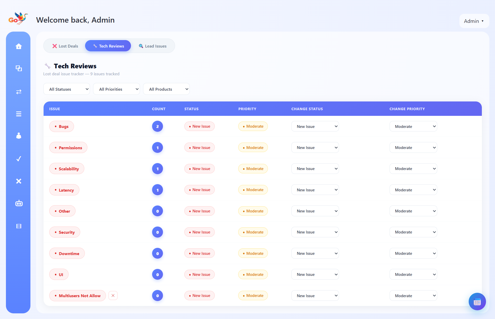

---

### 📄 Invoice & Agreement Generation
> Won deals automatically generate professional PDF invoices and service agreements — branded and ready to send.

---

### ❓ Help Center
> Built-in documentation covering all CRM modules and AI features — searchable and categorised.

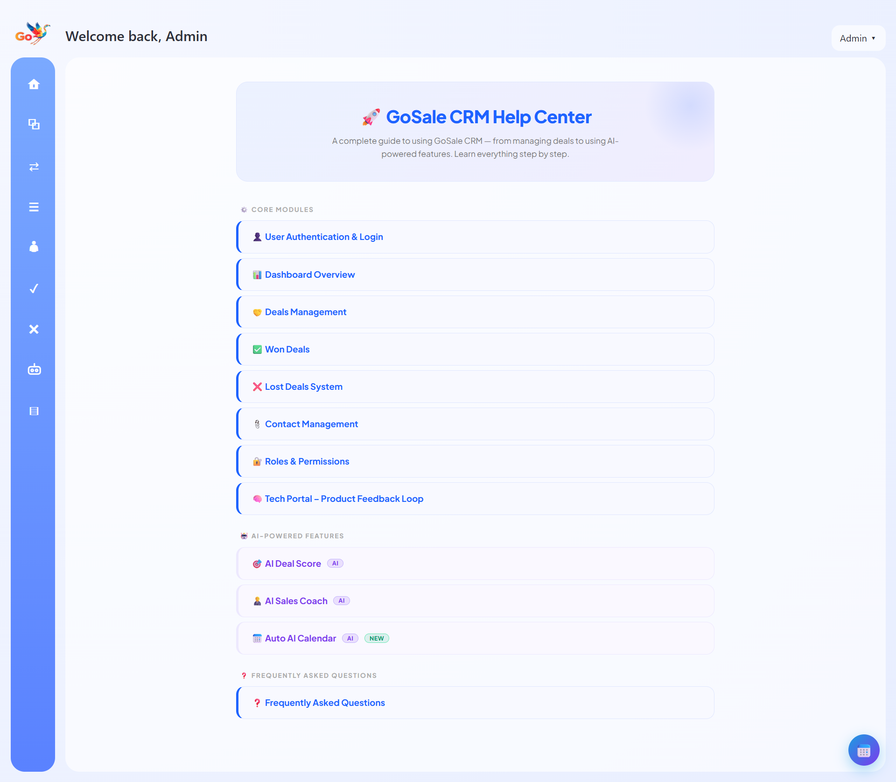

---

## Features

| Module | What it does |
|---|---|
| **Lead Management** | Track 70+ leads with AI scores, status, source, and product filters |
| **Deal Pipeline** | Manage deals across Prospect → Won → Lost stages |
| **AI Deal Scoring** | Predicts deal closure probability using pipeline and engagement data |
| **AI Sales Coach** | Analyses win/loss patterns and generates per-rep coaching reports |
| **Bulk Emailer** | Send personalised emails to leads/contacts with template variables |
| **Follow-up System** | Quick templates, note history, and scheduled follow-ups |
| **Activity Calendar** | Visual calendar for follow-ups, alerts, meetings, and calls |
| **Accounts & Contacts** | Organisation and contact management linked to deals |
| **Invoice Generation** | Auto-generate branded PDF invoices on deal close |
| **Agreement Generation** | Auto-generate service agreements for won deals |
| **Tech Reviews** | Track product issues from lost deals by category and priority |
| **Daily Reports** | Auto-generated daily activity summaries |
| **Help Center** | Built-in CRM documentation with module-level guides |
| **Role-based Access** | Multi-user with role and permission management |

---

## Tech Stack

| Layer | Technology |
|---|---|
| **Backend** | Python, Django |
| **Frontend** | HTML, CSS, Bootstrap, JavaScript |
| **Database** | SQLite / SQL |
| **AI** | Groq API (LLaMA 3.1) |
| **Deployment** | PythonAnywhere |
| **PDF Generation** | WeasyPrint / ReportLab |

---

## Project Structure

```
gosale-crm/
├── crm/                  # Core app — leads, deals, accounts, contacts
├── ai_coach/             # AI Sales Coach module
├── bulk_emailer/         # Bulk email module
├── ai_caller/            # AI Outbound Calling Agent (Twilio + Groq)
├── templates/            # HTML templates
├── static/               # CSS, JS, images
└── manage.py
```

---

## Live Demo

🌐 **[gosalescrm.pythonanywhere.com](https://gosalescrm.pythonanywhere.com)**

---

## About

Built by **Prajwal Kulkarni** — Full Stack Developer, Bengaluru.

[](https://www.linkedin.com/in/prajwal-a-kulkarni/)
[](https://github.com/Prajwal-A-Kulkarni/)

---

> *This repository is private. Screenshots and documentation are shared publicly to showcase the project.*
